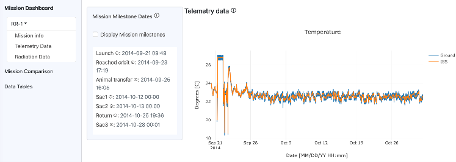
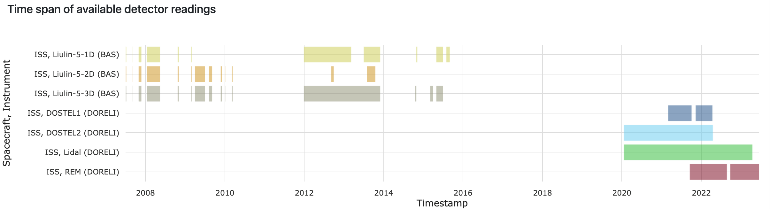

# NASA OSDR: News - 2023 AWG Symposium is Here!

OSDR News

[Return to article list >](broken-reference)

### New Visualization Apps on OSDR

The Open Science Data Repository (OSDR) team has been hard at work this year developing new visualization apps to provide additional information for your research and analysis needs using data from the OSDR. Read below for more information about the two latest apps.

Environmental Data Application

The Environmental Data Application provides the capability to visualize telemetry and radiation data collected on the International Space Station and corresponding ground platforms during the Rodent Research missions. Telemetry data includes temperature, relative humidity, and CO2 levels. Radiation data includes galactic cosmic rays, South Atlantic Anomaly, accumulated radiation dose, and total radiation dose. The application allows users to view single missions, compare two missions, and view and download summary or full data tables. So, come check out the new [Environmental Data Application](https://visualization.osdr.nasa.gov/eda) now!

RadLab Portal and RadLab Data API

The RadLab Portal provides access to radiation telemetry data from multiple databases maintained by multiple space agencies. The Web interface provides the ability to query, visualize, inspect, and download data; for example, time series plots of readings from multiple radiation detectors, pairwise comparisons of detector readings, and geospatial visualizations of radiation dose and flux registered by the detectors. The demo version of RadLab contains the data obtained from four detectors included in the DORELI project (DOSTEL1, DOSTEL2, Lidal, REM, Italian Space Agency) and the data from three Liulin-5 detectors (Bulgarian Academy of Sciences). All seven detectors are/were located on the International Space Station (ISS). The RadLab Data API enables data selection and retrieval at a programmatic level. Take a moment to explore the [RadLab Portal and Data API](https://visualization.osdr.nasa.gov/radlab) now!\

[Return to article list >](broken-reference)
