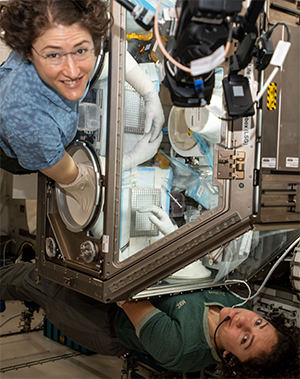

# Open Science for Life in Space

### New Visualization Apps on OSDR

The Open Science Data Repository (OSDR) team has been hard at work this year developing new visualization apps to provide additional information for your research and analysis needs using data from the OSDR. Continue reading for more information about our two latest apps:

Environmental Data Application

RadLab Portal and RadLab Data API

[Continue reading >>](broken-reference)

### Open Science at ASGSR 2023

The Open Science Data Repository team will be at ASGSR this year. Come check out our nineteen poster and oral presentations related to GeneLab, Ames Life Sciences Data Archive (ALSDA), NASA Biological Institutional Scientific Collection (NBISC), AI/ML, and student teams at ASGSR on Nov. 16-18, 2023. We've compiled this list to help you find your way amongst the breadth and depth of new insights that Open Science represents this year.

[Continue reading >>](broken-reference)

Open Science Projects primary goals aim to increase collaborative scientific data sharing, analysis and more rapid scientific advancement.

### GeneLab

***

GeneLab, an open science multi-omics repository, covering transcriptomics, metagenomics, epigenomics, proteomics, and metabolomics. Studies comprise of data from model organisms including microbes, plants, fruit flies, rodents and humans.

### BSP

***

The NASA Space Biology Biospecimen Sharing Program (BSP) collects biospecimens to maximize the scientific return from biological spaceflight and associated ground investigations and to encourage and broaden participation from the scientific community in space biology-related research.

### ALSDA

***

Ames Life Sciences Data Archive (ALSDA) collects, curates, and makes available space-relevant higher-order phenotypic datasets. Datasets that enable scientists to perform retrospective analysis across missions, experiments, life science disciplines, research subjects, and species.

### NBISC

***

NASA Biological Institutional Scientific Collection (NBISC) is a biorepository of non-human samples collected from NASA-funded spaceflight investigations and correlative ground studies. The purpose of NBISC is to receive, store, document, preserve, and make the collection available to the scientific community.

